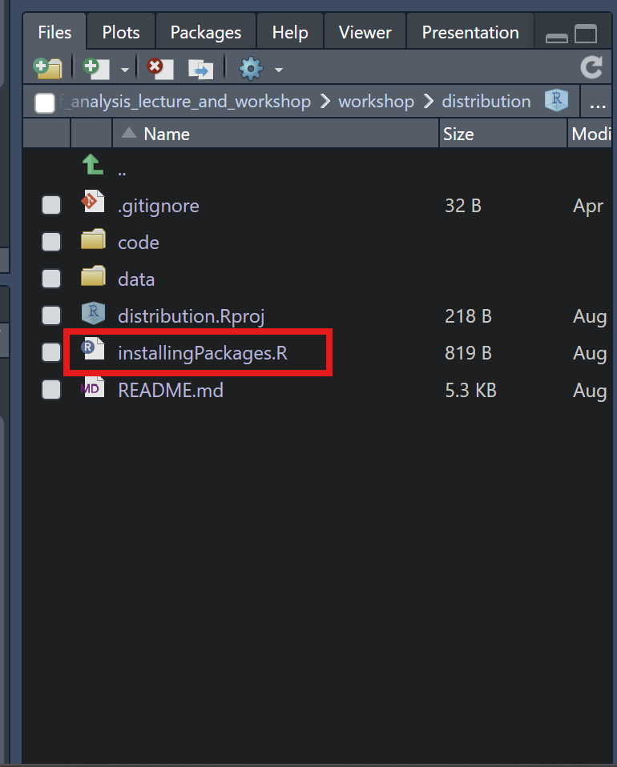

# 1. Introduction 
In this tutorial we will analyse a public data set (Georg et al. 2021, https://doi.org/10.1016/j.cell.2021.12.040) of single cell proteomics measured with Cytometry by Time of Flight (CyTOF). 

In this study, the authors performed CyTOF of whole blood samples from mild and severe COVID-19 patients during the acute and convalescent phase, and patients with other acute respiratory infections (Flu-like illness), as well as patients chronically infected by human immunodeficiency virus (HIV) or hepatitis B (HBV) and healthy controls. They analysed the T cell space and identified highly activated CD16+ T cells in severe COVID-19, which led the authors to hypothesise about the pathological role of these cytotoxic T cells. This hypothesis was then tested and confirmed with functional analyses, and found suitable mechanisms for their induction.

In this tutorial you will learn how to perform such computational analysis either in T cells, B cells, or monocytes!
	We invite you to give a look at the paper before the tutorial.

See you soon!

# 2. Setup
We will use so called `.Rmd` files which are a combination of R-code and nice formatting. The advantage is that the code and its results are directly connected. 

## 2.1 Setup the necessary `programs`
1. Download `R` from https://cran.r-project.org/index.html
2. Install `R`. 
3. (_Windows exclusive!_) Download `RTools` from https://cran.r-project.org/bin/windows/Rtools/
(make sure that the version fits the R version)
4. Install `Rtools`
5. Download `RStudio` https://www.rstudio.com/products/rstudio/download/#download
6. Install `RStudio` 

## 2.2 Clone the `GitHub repository`
You are already here! You can either download the code as an archive (Click the green "`Code`" button in the upper right corner and download as `ZIP`.) or follow the guide from Microsoft if you are a technical smartypants: https://docs.github.com/en/repositories/creating-and-managing-repositories/cloning-a-repository

## 2.3 Setup the necessary `packages`
There are many `packages` in R that hold much functionality you can directly use and do not have to code for yourself. 

In order to install the packages:

1.  Open the installed Rstudio
2.  Create a new project (`File` -> `New Project`) and point it to the folder with the **cloned repository**.
3.  Open `installingPackages.R` script

4. Either run each line of the code (`Ctrl+Enter per line`) or all of the code at once (`Ctrl+Shift+s` or `Ctrl+A`&`Ctrl+Enter`)
5. There can be some red messages, but there should be no warnings nor errors. If there are ***errors***, see below!

### **ACHTUNG**

For Linux and Mac, you may need to install additional libraries for some packages. If you are having errors during installation of the packages below, try this, then reach out to me if it doesn't work.

Mac:
- https://eol.pages.cms.hu-berlin.de/gcg_quantitative-methods/HowTo_r-on-macos.html
- https://mac.r-project.org/tools/ 

Linux: https://cran.r-project.org/bin/linux/ubuntu/fullREADME.html (r-base-dev)

# 3. Downloading Data
Get this `.csv` file and put it into the `data` folder of the cloned repository (your R Project folder):
[DOWNLOAD LINK](https://1drv.ms/f/c/7e6c087974dcbe2e/EhFsLcHFYVhDtfOAi_FRuOsBv86R8f_Ao5Y5jC2pTTeWng?e=xBX0Ox)

# 4. Help
Just let me know if you need help: 
- Lev Petrov (levpetrov@omnicyto.com)

