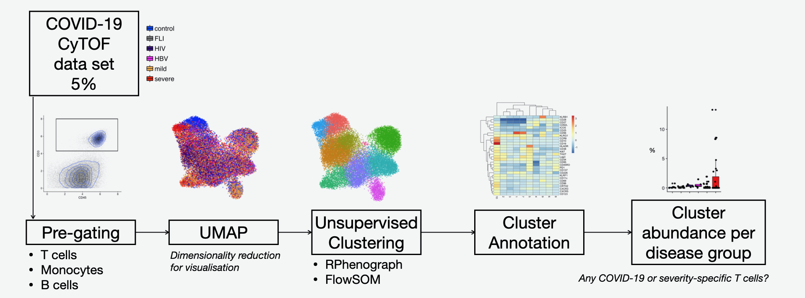

```{r setup, set.seed(1234)}
knitr::opts_chunk$set(
    fig.align = "center", message = F, warning = F, cache = T, cache.lazy = F,
    class.source = "fold-hide"
)
```

------------------------------------------------------------------------

## Load libraries

If packages are already installed on your system, you could just use
`library(tibble)`. Otherwise you have to install it first, here you have
multiple options:

-   Standard: `install.packages("insert_your_package_name")`
-   Automated: `pacman::p_load("insert_your_package_name")` This loads
    your package and installs it if not already present.

Usually, the packages you install are retrieved from `CRAN`:
<https://cran.r-project.org/> but not all packages are hosted there.
Especially for bio-related packages, there is `Bioconductor`:
<https://bioconductor.org/>

To install packages from Bioconductor, you can either follow the
instructions on the package site on Bioconductor (e.g.
<https://bioconductor.org/packages/release/bioc/html/ComplexHeatmap.html>
) which includes installing the `BiocManager` package.

Also `pacman` *also* searches Bioconductor, but *only* if BiocManager is
installed before!

Some packages are neither on `CRAN` nor on `Bioconductor` but on
`github`. `github` is a platform to version and distribute code. To
install `github` packages, you can:

-   Standard: `devtools::install_github("JinmiaoChenLab/Rphenograph")`
-   Automated: `pacman::p_load_gh("JinmiaoChenLab/Rphenograph")`

Additionally, you might need Rtools to build R packages. If you
just installed rtools you may need to restart Rstudio.

```{r lib}

if (!require(pacman)) {
    install.packages("pacman") # If not already installed
}
pacman::p_load("tidyverse", install = TRUE)
pacman::p_load("cowplot", install = TRUE)
pacman::p_load("uwot", install = TRUE)
pacman::p_load("data.table", install = TRUE)
pacman::p_load("pheatmap", install = TRUE) # Todo
pacman::p_load("needs", install = TRUE)
pacman::p_load("knitr", install = TRUE)
pacman::p_load("ggridges", install = TRUE)
pacman::p_load("grDevices", install = TRUE)

# Install BiocManager such that pacman can then find ComplexHeatmap by its own
pacman::p_load("BiocManager", install = TRUE)
pacman::p_load("ComplexHeatmap", install = TRUE)


# Github packages have to be dealt in a special way
# However you install them, you _need_ the "devtools" package
pacman::p_load("devtools", install = TRUE)
# Additionally, you might need "Rtools"
pacman::p_load_gh("JinmiaoChenLab/Rphenograph", install = TRUE)
pacman::p_load_gh("JinmiaoChenLab/cytofkit", install = TRUE)  # To solve..

pacman::p_load("dplyr", install = TRUE)

theme_set(theme_classic())
```

------------------------------------------------------------------------

## Overview of the tutorial

In this tutorial we will analyse a public data set ([Georg *et al.*
2021](https://www.cell.com/cell/pdf/S0092-8674(21)01562-2.pdf)) of
single cell phospho-proteomics measured with Cytometry by Time of Flight
(CyTOF). In this study, the authors performed CyTOF of whole blood
samples from mild and severe COVID-19 patients during the acute and
convalescent phase, and patients with other acute respiratory infections
(Flu-like illness), as well as patients chronically infected by human
immunodeficiency virus (HIV) or hepatitis B (HBV) and healthy controls.
They analysed the T cell space and identified highly activated CD16+ T
cells in severe COVID-19, which led the authors to hypothesise about the
pathological role of these cytotoxic T cells. This hypothesis was then
tested and confirmed with functional analyses, and found suitable
mechanisms for their induction. In this tutorial you will learn how to
perform such computational analysis either in T cells, B cells, or
monocytes!

Due to time constrains, we will analyse 5% of the data set. We will
start by manually pre-gating the immune cell type of interest, then we
will visually explore the data by reducing the dimensionality and
plotting a UMAP. After this, we will cluster the data to find discrete
communities of cells, using two different algorithms for comparison.
Then we will annotate/give names to these clusters by looking at the
average protein expression in each community/cluster. Finally, we will
calculate the abundance of each cluster per donor and identify COVID-19
or severe-specific clusters.




------------------------------------------------------------------------

### RMD TIPS

- Run the selected code line(s) with `Ctrl+Enter`
- Run the selected code chunk with `Ctrl+Shift+Enter`
- Run the next code chunk with `Ctrl+Alt+N`


------------------------------------------------------------------------

## Read the data

We start reading the data table "data_norm_sub.csv" with the function
`read.csv()`. \* The data has already been pre-processed + calibration
beads excluded (gating on Ce140 Bead channel) + doublets and debris
excluded (gating on DNA channels and Event_length) + dead cells excluded
(gating on Live-Dead mDOTA marker) + batch corrected (normalization
using BatchAdjust method, linearly scales signal distributions to
similar ranges using percentiles)

```{r read, results="hide"}
# results='hide' does not print messages to the generated output file

# Standard read.csv, works for most things, but fread is faster.
# data_norm_sub <- read.csv("./data/data_norm_sub5.csv")

data_norm_sub_fread <- data.table::fread("../data/data_norm_sub5.csv")

# fread is a special format, such that we have to convert it first into a usual data.frame
data_norm_sub <- data.frame(data_norm_sub_fread)
```

What are the columns? What are the rows?

```{r colnamesdata}
# Show the first 5 rows and all columns --> Rows are cells, columns are features per cell
print(data_norm_sub[1:5, ])

# Then take a look at only the column names
colnames(data_norm_sub)
```

Not all features of the cell are actual cell parameters. We want to
subset the values to only these parameters. Therefore, create a vector
with the name of each measured protein (what we call "the CyTOF panel").

```{r panelandcolors, results="hide"}
panel <- colnames(data_norm_sub)[15:54]

# color_severity is a named vector which we will use later.
# #xxxxxx is a html-coded color code.
color_severity <- c(
    "healthy" = "#0449FF",
    "FLI" = "#807F7F",
    "HIV" = "#40007F",
    "HBV" = "magenta",
    "mild/moderate" = "#FFB651",
    "severe/critical" = "#F82000"
)
```

Let's look at how the values of markers are distributed:

```{r panel_linear, fig.height=10, fig.width=10}
data_norm_sub %>%
    # take only 20% of the data such that the plots are generated faster
    sample_frac(0.2) %>%
    # Pivot: All columns defined by "panel" will go into two columns.
    # The values go into the new column "value"
    # The names of the columns go into the new column "marker"
    pivot_longer(names_to = "marker", values_to = "value", panel) %>%
    # start plotting, x-axis is the value
    ggplot(aes(x = value)) +
    # We want density plots, so how the values on the x-axis are distributed
    geom_density() +
    # facet_wrap splits the plots according to the specified column, here "marker"
    # scale="free" tells that the x-axis and y-axis are not the same for each plot
    facet_wrap(~marker, scale = "free") +
    # theme_classic() sets the look of the final plot
    theme_classic()
```

We notice that these are skewed distributions: Many small values, some
very large values. Therefore, it makes more sense to look at these on a
logarithmic scale. In the CyTOF community, people commonly use the
hyperbolic arcsine (asinh) transformation:
$$
\rm asinh(x) = \ln(x + \sqrt{x^2+1})
$$


```{r panel_log, fig.height=10, fig.width=10}
# Transform all columns defined by "panel" with asinh()
data_norm_sub_trans <- data_norm_sub %>%
    # Apply asinh() on all columns defined by panel
    mutate_at(vars(panel), asinh)

data_norm_sub_trans %>%
    # take only 20% of the data such that the plots are generated faster
    sample_frac(0.2) %>%
    # ?Todo what?
    pivot_longer(names_to = "marker", values_to = "value", panel) %>%
    # Start plotting, define "value" as x-axis
    ggplot(aes(x = value)) +
    # Density plots, how are the values on the x-axis distributed
    geom_density() +
    # Split the plots according to the "marker" column, different axis
    facet_wrap(~marker, scale = "free") +
    # How the plot looks
    theme_classic()
```

------------------------------------------------------------------------

## Pre-gating of T cells

Using `ggplot()` and `geom_point()`, generate a scatter plot to decide
the gates.\
We visualize just 10% of the data.


### CD45+CD3+

```{r gateTcells1, fig.height=5, fig.width=5}
data_norm_sub_trans %>%
    # The plots would be overwhelmed with cells being exactly 0 (CyTOF-"ownness")
    filter(CD45 > 0, CD3 > 0) %>%
    # Use only 10% of the data
    sample_frac(0.1) %>%
    # Make a plot where the x-axis are the CD45 values, and the y-axis are the CD3 values
    ggplot(aes(x = CD45, y = CD3)) +
    # Each value will be a _point_ with a certain size
    # and a certain transparency (alpha)
    geom_point(size = 0.01, alpha = 0.1) +
    # Additionally to the points, plot the density of the points in 2 dimensions
    geom_density_2d() +
    # Plot a rectangle with the given coordinates
    # We found the coordinates by hand
    # Alpha=0 because otherwise you would have a filled rectangle
    geom_rect(mapping = aes(xmin = 1, xmax = 8, ymin = 4.3, ymax = 8), color = "black", alpha = 0) +
    theme_classic()
```

### CD45+CD3+CD15-CD19-

Exclude neutrophils (CD15+) and B cells (CD19+, they exchange antigens
with T cells)

```{r gateTcells2, fig.height=5, fig.width=5}
data_norm_sub_trans %>%
    # Retain all cells where the following rules apply
    filter(
        CD3 > 4.3,
        CD45 > 1,
        CD15 > 0,
        CD19 > 0
    ) %>%
    # Plot CD15 (y-axis) vs CD19 (x-axis)
    ggplot(aes(x = CD19, y = CD15)) +
    # Plot points with certain size and color alpha
    geom_point(size = 0.01, alpha = 0.1) +
    # Make 2d-density plots
    geom_density_2d() +
    # Plot a rectangle
    # Alpha because geom_rect makes a filled rectangle otherwise
    geom_rect(mapping = aes(
        xmin = 0, xmax = 2.9, ymin = 0, ymax = 4
    ), color = "black", alpha = 0) +
    theme_classic()
```

### Percentage of T cells

We first add a column to the data table where each cell gets the
classification T cell = {TRUE, FALSE} according to your gating strategy.
Then let's see if the percentage of T cells make sense and how it looks
per disease group (variable `sev_merge`).

```{r columnTcells}
data_norm_sub_trans <- data_norm_sub_trans %>%
    # ifelse(logical_value, if TRUE, if FALSE)
    # ifelse returns the value inside if TRUE when the logical
    # value is TRUE, otherwise the other value.

    # Draw proper gates in the transformed values to get the (CD45+CD3+CD15-CD19-) cells
    mutate(Tcell = ifelse(CD3 > 4.3 & CD45 > 1 & CD15 < 4 & CD19 < 2.9, TRUE, FALSE))
```

```{r percTcells}
data_norm_sub_trans <- data_norm_sub_trans %>%
    # Factors are R-internal special vectors having "levels".
    # All values must be a value of "levels". Internally, a factor is a numeric value pointing
    # to one of the levels.
    # ggplot is smart enough to handle factors properly (better than only vectors if needed)!
    mutate(
        sev_merge = factor(
            sev_merge,
            levels = c("healthy", "FLI", "HIV", "HBV", "mild/moderate", "severe/critical")
        )
    )

data_norm_sub_trans %>%
    # count for each combination of
    #   id:             Sample id
    #   Tcell:          If it is a Tcell or not
    #   sev_merge:      Which severity it is (sev_merge = mild+moderate and severe+critical merged)
    #   Disease.phase:  acute or covalescent
    # How many cells there are
    # Count saves that in a new column "n"
    dplyr::count(id, Tcell, sev_merge, Disease.phase) %>%
    # Result:
    #     id Tcell       sev_merge Disease.phase     n
    #     19 FALSE severe/critical         acute  1806
    #     19  TRUE severe/critical         acute    22
    #     15 FALSE severe/critical         acute  2407

    # tidyverse functions can leverage "groups" of data, but you have to specify first
    # what the group is defined on.
    # Here we want to group the cells based on their (sample-) id
    group_by(id) %>%
    # We grouped the table by id (the sample)
    #   Now we define perc as "n" divided by the sum of all "n"s times 100
    # This is applied _inside each group_
    # After each group has only two rows (Tcell = TRUE or FALSE)
    # This is effectively the percentage of T-cells in each sample
    mutate(perc = n / sum(n) * 100) %>%
    # We do not need the grouping anymore, therefore remove it
    ungroup() %>%
    # Select only Tcells (As "Tcell" is a True/False column)
    filter(Tcell) %>%
    # plot the just calculated percentage on the y-axis
    # And the severity on the x-axis
    # "fill" fills plots, usually used for coloring.
    ggplot(aes(y = perc, x = sev_merge, fill = sev_merge)) +
    # Make a boxplot per fill-value. That happens automatically.
    # Alpha sets the color-density
    geom_boxplot(position = position_dodge(1), alpha = 0.7) +
    # ?Todo: What happens here
    geom_dotplot(
        binaxis = "y", stackdir = "center",
        position = position_dodge(1), alpha = 0.7
    ) +
    # facet_grid splits the plots according to multiple values,
    # you could even use multiple splitting-values
    # with "free_x" we allow the x-axis to vary between plots, but the y-axis is fixed.
    facet_grid(~Disease.phase, space = "free_x", scale = "free_x") +
    # Previously we defined the coloring for the severity stages, here we apply it.
    scale_fill_manual(values = color_severity) +
    # Set y-axis label
    ylab("Percentage of T cells (%)") +
    # Set x-axis label to empty ("")
    xlab("") +
    theme_classic() +
    # Remove the x-axis text and ticks.
    theme(
        axis.text.x = element_blank(),
        axis.ticks.x = element_blank()
    )
```

### Manual gating of T cell comparment (CD4+, CD8+, TCRgd+)

We are actually interested in finding T cell communities but in each
main T cell compartment (CD4+, CD8+ and TCRgd+). For this, we manually
gate T cells based on CD8 and TCRgd parameters.

Gates were defined per CyTOF run. Due to time restrictions, we are
providing the gates in asinh-scale. Eg.: If the cell has an asinh-signal
of TCRgd lower or equal than the threshold, and a asinh-signal of CD8
lower or equal than the corresponding CD8 threshold, then the cell is
CD4+.

We then create a new column "Tcellcompartment" and classify the cell
according to the gates.

```{r gatesTcells}
gates <- tibble(
    # Each "run" has different gates we found manually.
    Run = as.numeric(str_sort(unique(data_norm_sub_trans$Run))),
    CD8threshold = c(3.9, 4.15, 3.7, 3.7, 4.3, 4.1, 3.8, 4.4, 5.1, 4.85, 4.55, 4.55, 4, 5, 4.2),
    TCRgdthreshold = c(2.85, 2.85, 2.85, 2.85, 2.85, 2.85, 2.85, 2.85, 2.85, 2.85, 2.85, 2.85, 2.85, 2.85, 3.7)
)
```

```{r applyGates}
data_Tcell <- data_norm_sub_trans %>%
    # filter (keep) all rows where Tcell is TRUE
    filter(Tcell)

data_Tcell <- data_Tcell %>%
    # Show what happens here using left join
    # Left join takes the "left" argument, here given implicitely with "%>%", so it is data_Tcell
    # Then the dataframe "gates" is joined with data_Tcell using "Run" as "join"-value
    left_join(gates) %>%
    # According to the gates we assign a T cell compartment label to each cell
    mutate(Tcellcompartment = case_when(
        TCRgd <= TCRgdthreshold & CD8 <= CD8threshold ~ "CD4+",
        TCRgd <= TCRgdthreshold & CD8 > CD8threshold ~ "CD8+",
        TRUE ~ "TCRgd+"
    ))
```

```{r visualizeGateTcellcompartment, fig.height=5, fig.width=8,  results = 'asis'}
data_Tcell %>%
    # Plot CD8 (x-axis) and TCRgd (y-axis)
    ggplot(aes(x = CD8, y = TCRgd)) +
    # Use points, color them according to Tcellcompartment with certain size and alpha.
    geom_point(aes(color = Tcellcompartment), size = 0.5, alpha = 0.5) +
    theme_classic() +
    # ? Todo: What is happening here?
    guides(colour = guide_legend(override.aes = list(size = 5)))
```

```{r percTcellcompartmentAllSamples, fig.height=5, fig.width=5}
data_Tcell %>%
    # Count how many cells there are in every Tcellcompartment
    dplyr::count(Tcellcompartment) %>%
    #   Tcellcompartment     n
    # 1             CD4+ 66528
    # 2             CD8+ 36605
    # 3           TCRgd+  2354
    # We define perc as "n" divided by the sum of all "n"s times 100
    # There is 3 "n"-values (because 3 rows), therefore this is effectively
    # the percentage of cells in each Tcellcompartment
    mutate(perc = n / sum(n) * 100) %>%
    # Plot the percentage (y-axis) of each Tcellcompartment (x-axis) colored by Tcellcompartment
    # and label it with the percentage, rounded to 2 decimal points
    ggplot(aes(x = Tcellcompartment, y = perc, fill = Tcellcompartment, label = round(perc, 2))) +
    # We use geom_col to plot the number of cells per compartment as column bars. Dodge means the bars are not stacked, but separated bars. 
    geom_col(position = "dodge") +
    # We defined WHAT the labels should contain, now we actually plot them
    geom_label() +
    theme_classic() +
    # Rotate the x-axis label, remove the legend
    theme(axis.text.x = element_text(angle = 45, vjust = 1, hjust = 1), legend.position = "none") +
    # Set the y-axis label
    ylab("Percentage of each T cell compartment from all T cells (%)") +
    # Remove the x-axis label
    xlab("")
```

------------------------------------------------------------------------

## UMAP {.tabset}

<https://pair-code.github.io/understanding-umap/>

We now compute the UMAPs for each T cell compartment across all samples
(acute and convalescent). We use all markers, except the parameters we
used for gating. We also exclude IgD, IgM, CD21, and CD14.

We define a vector "sel_markers_Tcells" removing all parameters we do
not want to include for the calculation of the UMAP.

```{r sel_markers_Tcells}
# panel %in% c("text1", "text2", ...)
#   Returns a vector which is TRUE if its corresponding value in "panel"
#   is in the vector on the right and FALSE if it is not.
# ! panel %in% c("text1", "text2", ...)
#   inverts this logical vector, so FALSE if value is contained in the right, TRUE if not.
# panel[!panel %in% c("CD45","CD3", "CD19","CD15","CD8","TCRgd","IgD","IgM","CD21","CD14")]
#   selects the TRUE values in "panel" according to the just specified vector.
sel_markers_Tcells <- panel[!panel %in% c(
    "CD45", "CD3", "CD19", "CD15", "CD8",
    "TCRgd", "IgD", "IgM", "CD21", "CD14"
)]
```

Before calculating the UMAP, is important we transform our data
(`asinh`) and apply z-score standardization (function `scale`). Why?

```{r computeUMAP}
transformed_scaled_data <- data_Tcell %>%
    # Then apply scale() on all columns defined by sel_markers_Tcells
    mutate_at(vars(sel_markers_Tcells), scale)

UMAP_TCRgd <- transformed_scaled_data %>%
    # Filter all cells which are TCRgd+
    filter(Tcellcompartment == "TCRgd+") %>%
    # Select only the sel_markers_Tcells columns
    select(sel_markers_Tcells) %>% 
    # Calculate UMAP with defined hyperparameters
    uwot::umap(
        # The size of local neighborhood
        n_neighbors = 30,
        # The effective scale of embedded points. In combination with min_dist,
        # this determines how clustered/clumped the embedded points are.
        spread = 1,
        # The effective minimum distance between embedded points
        min_dist = 0.5,
        # Type of distance metric to use to find nearest neighbors
        metric = "euclidean",
        # If TRUE, log details to the console.
        verbose = TRUE,
        # Setting fast_sgd to TRUE will speed up the stochastic optimization phase, but give a
        # potentially less accurate embedding, and which will not be exactly reproducible
        # even with a fixed seed.
        fast_sgd = TRUE
    )

UMAP_CD4 <- transformed_scaled_data %>%
    # Filter all cells which are CD4+
    filter(Tcellcompartment == "CD4+") %>%
   # Select only the sel_markers_Tcells columns
    select(sel_markers_Tcells) %>% 
    # Calculate UMAP with defined hyperparameters
    uwot::umap(
        n_neighbors = 30,
        spread = 1,
        min_dist = 0.5,
        metric = "euclidean",
        verbose = TRUE,
        fast_sgd = TRUE
    )

UMAP_CD8 <- transformed_scaled_data %>%
    # Filter all cells which are CD8+
    filter(Tcellcompartment == "CD8+") %>%
   # Select only the sel_markers_Tcells columns
    select(sel_markers_Tcells) %>% 
    # Calculate UMAP with defined hyperparameters
    uwot::umap(
        n_neighbors = 30,
        spread = 1,
        min_dist = 0.5,
        metric = "euclidean",
        verbose = TRUE,
        fast_sgd = TRUE
    )


#### Add UMAP information to the complete data frame

transformed_scaled_data$UMAP1 <- NA
transformed_scaled_data$UMAP2 <- NA

transformed_scaled_data$UMAP1[transformed_scaled_data$Tcellcompartment == "CD4+"] <- UMAP_CD4[, 1]
transformed_scaled_data$UMAP1[transformed_scaled_data$Tcellcompartment == "CD8+"] <- UMAP_CD8[, 1]
transformed_scaled_data$UMAP1[transformed_scaled_data$Tcellcompartment == "TCRgd+"] <- UMAP_TCRgd[, 1]


transformed_scaled_data$UMAP2[transformed_scaled_data$Tcellcompartment == "CD4+"] <- UMAP_CD4[, 2]
transformed_scaled_data$UMAP2[transformed_scaled_data$Tcellcompartment == "CD8+"] <- UMAP_CD8[, 2]
transformed_scaled_data$UMAP2[transformed_scaled_data$Tcellcompartment == "TCRgd+"] <- UMAP_TCRgd[, 2]
```

We now plot each UMAP, coloured by severity, disease phase, and
intensity of a selected marker. Recommendation: Subsample CD4+ and CD8+
T cells for visualization, using `sample_n()`, or `sample_frac`.

### Severity

Do you observe specific areas where CV19 samples accumulate? What does
this mean?

```{r UMAP_severity, fig.height=7, fig.width=21}


p1 <- transformed_scaled_data %>%
    # Select CD4+ Tcell compartment
    filter(Tcellcompartment == "CD4+") %>%
    # Sample 30000 rows (=cells)
    sample_n(30000) %>%
    # Plot the two just calculated UMAPs, color according to sev_merge(severity)
    ggplot(aes(x = UMAP1, y = UMAP2, color = sev_merge)) +
    # Plot points
    geom_point(alpha = 0.5, size = 2) +
    # Bigger and not transparent dots for the legend
    guides(colour = guide_legend(ncol = 1, override.aes = list(size = 3, alpha = 1))) +
    # Use our previously defined colors
    scale_color_manual(values = color_severity, name = "") +
    theme_classic() +
    # Set a proper title!
    # Always set proper titles. The idea is that you should be able to send a plot to you boss and
    # he should understand what happens by just looking at the plot.
    ggtitle("CD4+ T cells") +
    # legend.position="none" removes the legend
    # plot.title = element_text(hjust...) adjusts the horizontal adjustment (placing) of the title.
    theme(legend.position = "none", plot.title = element_text(hjust = 0.5))

p2 <- transformed_scaled_data %>%
    # Select CD8+ Tcell compartment
    filter(Tcellcompartment == "CD8+") %>%
    # Sample 30000 rows (=cells)
    sample_n(30000) %>%
    # Plot the two just calculated UMAPs, color according to sev_merge(severity)
    ggplot(aes(x = UMAP1, y = UMAP2, color = sev_merge)) +
    # Plot points
    geom_point(alpha = 0.5, size = 2) +
    # Bigger and not transparent dots for the legend
    guides(colour = guide_legend(ncol = 1, override.aes = list(size = 3, alpha = 1))) +
    # Use our previously defined colors
    scale_color_manual(values = color_severity, name = "") +
    theme_classic() +
    # Set a proper title!
    # Always set proper titles. The idea is that you should be able to send a plot to you boss and
    # he should understand what happens by just looking at the plot.
    ggtitle("CD8+ T cells") +
    # legend.position="none" removes the legend
    # plot.title = element_text(hjust...) adjusts the horizontal adjustment (placing) of the title.
    theme(legend.position = "none", plot.title = element_text(hjust = 0.5))

p3 <- transformed_scaled_data %>%
    # Select TCRgd+ Tcell compartment
    filter(Tcellcompartment == "TCRgd+") %>%
    # Plot the two just calculated UMAPs, color according to sev_merge(severity)
    ggplot(aes(x = UMAP1, y = UMAP2, color = sev_merge)) +
    # Plot points
    geom_point(alpha = 0.5, size = 3) +
    #  Bigger and not transparent dots for the legend
    guides(colour = guide_legend(ncol = 1, override.aes = list(size = 3, alpha = 1))) +
    # Use our previously defined colors
    scale_color_manual(values = color_severity, name = "") +
    theme_classic() +
    # Set a proper title!
    # Always set proper titles. The idea is that you should be able to send a plot to you boss and
    # he should understand what happens by just looking at the plot.
    ggtitle("TCRgd+ T cells") +
    # The last plot SHOULD have a legend.
    # Note that technically this legend is only legit for p3 not for p2 or p1 because the color
    # limits might be different
    theme(
        legend.position = "right", legend.direction = "vertical",
        plot.title = element_text(hjust = 0.5)
    )

# Until now we did CALCULATE the plots, but not actually plot them, that is the idea of ggplot.
# First BUILD the plots, only plot them at the very end.
# With plot_grid(..., nrow=1) we define that all sub-plots (p1, p2, p3) are plotted in one row.
plot_grid(p1, p2, p3, nrow = 1)
```

### Disease phase

Do you observe specific areas where convalescent samples accumulate?
What does this mean?

```{r UMAP_diseasephase, fig.height=7, fig.width=21}


p1 <- transformed_scaled_data %>%
    # Keep "CD4+" and only covid19 samples  (Group == "CV19")
    filter(Tcellcompartment == "CD4+", Group == "CV19") %>%
    # Plot the two just calculated UMAPs, color according to Disease.phase
    ggplot(aes(x = UMAP1, y = UMAP2, color = Disease.phase)) +
    # Plot points
    geom_point(alpha = 0.5, size = 2) +
    #  Bigger and not transparent dots for the legend
    guides(colour = guide_legend(ncol = 1, override.aes = list(size = 3, alpha = 1))) +
    # Define manual colors. We defined that the column "Disease.phase" should define the color
    # Inside Disease.phase are the values "acute" and "convalescent"
    # With scale_color_manual we can explicitly define which color they should get.
    scale_color_manual(values = c("acute" = "red", "convalescent" = "black"), name = "") +
    theme_classic() +
    # Seting a proper title!
    ggtitle("CD4+ T cells") +
    # legend.position="none" removes the legend
    # plot.title = element_text(hjust...) adjusts the horizontal adjustment (placing) of the title.
    theme(legend.position = "none", plot.title = element_text(hjust = 0.5))

p2 <- transformed_scaled_data %>%
    # Keep "CD8+" and only covid19 samples  (Group == "CV19")
    filter(Tcellcompartment == "CD8+", Group == "CV19") %>%
    # Plot the two just calculated UMAPs, color according to Disease.phase
    ggplot(aes(x = UMAP1, y = UMAP2, color = Disease.phase)) +
    # Plot points
    geom_point(alpha = 0.5, size = 2) +
    #  Bigger and not transparent dots for the legend
    guides(colour = guide_legend(ncol = 1, override.aes = list(size = 3, alpha = 1))) +
    # Define manual colors. We defined that the column "Disease.phase" should define the color
    # Inside Disease.phase are the values "acute" and "convalescent"
    # With scale_color_manual we can explicitly define which color they should get.
    scale_color_manual(values = c("acute" = "red", "convalescent" = "black"), name = "") +
    theme_classic() +
    # Seting a proper title!
    ggtitle("CD8+ T cells") +
    # legend.position="none" removes the legend
    # plot.title = element_text(hjust...) adjusts the horizontal adjustment (placing) of the title.
    theme(legend.position = "none", plot.title = element_text(hjust = 0.5))

p3 <- transformed_scaled_data %>%
    # Keep "TCRgd+" and only covid19 samples  (Group == "CV19")
    filter(Tcellcompartment == "TCRgd+", Group == "CV19") %>%
    # Plot the two just calculated UMAPs, color according to Disease.phase
    ggplot(aes(x = UMAP1, y = UMAP2, color = Disease.phase)) +
    # Plot points
    geom_point(alpha = 0.5, size = 3) +
    # Bigger and not transparent dots for the legend
    guides(colour = guide_legend(ncol = 1, override.aes = list(size = 3, alpha = 1))) +
    # Define manual colors. We defined that the column "Disease.phase" should define the color
    # Inside Disease.phase are the values "acute" and "convalescent"
    # With scale_color_manual we can explicitly define which color they should get.
    scale_color_manual(values = c("acute" = "red", "convalescent" = "black"), name = "") +
    theme_classic() +
    # Seting a proper title!
    ggtitle("TCRgd+ T cells") +
    # The last plot SHOULD have a legend.
    # Note that technically this legend is only legit for p3 not for p2 or p1 because the color
    # limits might be different
    theme(plot.title = element_text(hjust = 0.5))


plot_grid(p1, p2, p3, nrow = 1)
```

### Marker intensity

```{r UMAP_markers, fig.height=7, fig.width=21}

p1 <- transformed_scaled_data %>%
    filter(Tcellcompartment == "CD4+") %>%
    sample_n(30000) %>%
    ggplot(aes(x = UMAP1, y = UMAP2, color = HLADR)) +
    geom_point(alpha = 0.5, size = 2) +
    theme_classic() +
    ggtitle("CD4+ T cells") +
    theme(legend.position = "none", plot.title = element_text(hjust = 0.5)) +
    scale_color_gradient2(low = "blue", mid = "grey", high = "red", midpoint = 0)


p2 <- transformed_scaled_data %>%
    filter(Tcellcompartment == "CD8+") %>%
    sample_n(30000) %>%
    ggplot(aes(x = UMAP1, y = UMAP2, color = HLADR)) +
    geom_point(alpha = 0.5, size = 2) +
    theme_classic() +
    ggtitle("CD8+ T cells") +
    theme(legend.position = "none", plot.title = element_text(hjust = 0.5)) +
    scale_color_gradient2(low = "blue", mid = "grey", high = "red", midpoint = 0)


p3 <- transformed_scaled_data %>%
    filter(Tcellcompartment == "TCRgd+") %>%
    ggplot(aes(x = UMAP1, y = UMAP2, color = HLADR)) +
    geom_point(alpha = 0.5, size = 3) +
    theme_classic() +
    ggtitle("TCRgd+ T cells") +
    theme(plot.title = element_text(hjust = 0.5)) +
    scale_color_gradient2(low = "blue", mid = "grey", high = "red", midpoint = 0)

plot_grid(p1, p2, p3, nrow = 1)
```

------------------------------------------------------------------------

## Unsupervised clustering {.tabset}

We now perform unsupervised clustering analysis on samples from control,
FLI, HIV, HBV, and acute COVID-19 using the selected markers. As done
for the UMAP calculation, before clustering is important we transform
and z-score normalize our data. Let's look at the distribution of the
markers used for clustering:

```{r distMarkersClust, fig.height=10, fig.width=10}
transformed_scaled_data %>%
    filter(Tcellcompartment == "CD8+", Disease.phase == "acute") %>%
    select(sel_markers_Tcells) %>%
    pivot_longer(names_to = "marker", values_to = "value", everything()) %>%
    ggplot(aes(value)) +
    geom_density() +
    facet_wrap(~marker, scale = "free") +
    theme_classic()
```

Due to time constraints, we will only cluster one T cell compartment,
eg.: CD8+ T cells.

**What's the main difference between RPhenograph and FlowSOM?**

### Run {.tabset}

#### RPhenograph

**IMPORTANT!** In RPhenograph we define the number of nearest
neighbours.

```{r runRphenograph, results="hide"}
start_time <- Sys.time()


clust_cd8_rpheno <- transformed_scaled_data %>%
    filter(Tcellcompartment == "CD8+", Disease.phase == "acute") %>%
    select(sel_markers_Tcells) %>%
    Rphenograph(k = 30)

end_time <- Sys.time()
```

```{r time_elapsed_Rpheno}
time_elapsed <- round(as.numeric(gsub("Time difference of ", "", difftime(end_time, start_time, units = "mins"))), 2)
print(paste("\n", time_elapsed, "minutes passed"))
```

After running the clustering algorithm, we add a column "Rpheno" in the
data table with the cluster label for each cell:

```{r add_clust_info}
clust_ids <- transformed_scaled_data %>%
    filter(Tcellcompartment == "CD8+", Disease.phase == "acute") %>%
    pull(cellid)

clust_cd8_rpheno <- tibble(cellid = clust_ids, Rpheno = as.character(igraph::membership(clust_cd8_rpheno)))

transformed_scaled_data <- transformed_scaled_data %>% left_join(clust_cd8_rpheno)

transformed_scaled_data <- transformed_scaled_data %>% mutate(Rpheno = factor(Rpheno, levels = str_sort(unique(Rpheno), numeric = TRUE)))
```

#### FlowSOM

**IMPORTANT!** In FlowSOM we define the number of clusters.

```{r runflowsom, results="hide"}
start_time <- Sys.time()

clust_cd8_flowsom <- transformed_scaled_data %>%
    filter(Tcellcompartment == "CD8+", Disease.phase == "acute") %>%
    select(sel_markers_Tcells) %>%
    cytof_cluster(xdata = ., method = "FlowSOM", FlowSOM_k = 10)

end_time <- Sys.time()
```

```{r time_elapsed_fs}
time_elapsed <- round(as.numeric(gsub("Time difference of ", "", difftime(end_time, start_time, units = "mins"))), 2)
print(paste("\n", time_elapsed, "minutes passed"))
```

After running the clustering algorithm, we add a column "flowsom" in the
data table with the cluster label for each cell:

```{r add_clust_info_fs}
clust_ids <- transformed_scaled_data %>%
    filter(Tcellcompartment == "CD8+", Disease.phase == "acute") %>%
    pull(cellid)

clust_cd8_flowsom <- tibble(cellid = clust_ids, flowsom = as.character(clust_cd8_flowsom))
transformed_scaled_data <- transformed_scaled_data %>% left_join(clust_cd8_flowsom)
transformed_scaled_data <- transformed_scaled_data %>% mutate(flowsom = factor(flowsom, levels = str_sort(unique(flowsom), numeric = TRUE)))
```

### Cluster size {.tabset}

We now visualize the number of cells in each cluster:

#### Rphenograph

```{r clustSize, fig.height=5, fig.width=10}
transformed_scaled_data %>%
    filter(Tcellcompartment == "CD8+", Disease.phase == "acute") %>%
    dplyr::count(Rpheno) %>%
    ggplot(aes(x = Rpheno, y = n, label = n)) +
    geom_col(position = "dodge") +
    theme_classic() +
    geom_label()
```

#### FlowSOM

```{r clustSize_fs, fig.height=5, fig.width=10}
transformed_scaled_data %>%
    filter(Tcellcompartment == "CD8+", Disease.phase == "acute") %>%
    dplyr::count(flowsom) %>%
    ggplot(aes(x = flowsom, y = n, label = n)) +
    geom_col(position = "dodge") +
    theme_classic() +
    geom_label()
```

### UMAP clusters {.tabset}

And then plot the UMAP, this time coloured by cluster:

#### RPhenograph

```{r UMAP_clusters_Rpheno, fig.height=5, fig.width=7}
transformed_scaled_data %>%
    filter(Tcellcompartment == "CD8+", Disease.phase == "acute") %>%
    ggplot(aes(x = UMAP1, y = UMAP2, color = Rpheno)) +
    geom_point(alpha = 0.5, size = 1) +
    guides(colour = guide_legend(ncol = 1, override.aes = list(size = 3, alpha = 1))) +
    theme_classic() +
    ggtitle("CD8+ T cells") +
    theme(plot.title = element_text(hjust = 0.5))
```

#### FlowSOM

```{r UMAP_clusters_fs, fig.height=5, fig.width=7}
transformed_scaled_data %>%
    filter(Tcellcompartment == "CD8+", Disease.phase == "acute") %>%
    ggplot(aes(x = UMAP1, y = UMAP2, color = flowsom)) +
    geom_point(alpha = 0.5, size = 1) +
    guides(colour = guide_legend(ncol = 1, override.aes = list(size = 3, alpha = 1))) +
    theme_classic() +
    ggtitle("CD8+ T cells") +
    theme(plot.title = element_text(hjust = 0.5))
```

### Marker distribution {.tabset}

Let's look at the marker distribution per cluster:

#### RPhenograph

```{r distMarkersClust_rpheno, fig.height=10, fig.width=10}
transformed_scaled_data %>%
    filter(Tcellcompartment == "CD8+", Disease.phase == "acute") %>%
    select(sel_markers_Tcells, Rpheno) %>%
    pivot_longer(names_to = "marker", values_to = "value", sel_markers_Tcells) %>%
    ggplot(aes(x = value, fill = Rpheno, y = Rpheno)) +
    geom_density_ridges() +
    facet_wrap(~marker, scale = "free") +
    theme_classic()
```

#### FlowSOM

```{r distMarkersClust_flowsom, fig.height=10, fig.width=10}
transformed_scaled_data %>%
    filter(Tcellcompartment == "CD8+", Disease.phase == "acute") %>%
    select(sel_markers_Tcells, flowsom) %>%
    pivot_longer(names_to = "marker", values_to = "value", sel_markers_Tcells) %>%
    ggplot(aes(x = value, fill = flowsom, y = flowsom)) +
    geom_density_ridges() +
    facet_wrap(~marker, scale = "free") +
    theme_classic()
```

------------------------------------------------------------------------

## Cluster annotation {.tabset}

We now want to actually understand what are these clusters we found. For
this, we can visualize the average expression of each marker in each
cluster with a heatmap.\*\* Remember to do the corresponding
transformation of the intensity values.\*\*

### Heatmap (ggplot) {.tabset}

#### Rphenograph

```{r heatmapClusters, fig.height=5, fig.width=5}

transformed_scaled_data %>%
    filter(Tcellcompartment == "CD8+", Disease.phase == "acute") %>%
    select(sel_markers_Tcells, Rpheno) %>%
    group_by(Rpheno) %>%
    summarise_at(vars(sel_markers_Tcells), funs(mean(., na.rm = TRUE))) %>%
    pivot_longer(names_to = "markers", values_to = "avg_zscore", -Rpheno) %>%
    mutate(markers = factor(markers, levels = rev(sel_markers_Tcells))) %>%
    ggplot(aes(x = Rpheno, y = markers, fill = avg_zscore)) +
    geom_tile() +
    scale_fill_gradient2(low = "blue", mid = "white", high = "red", limits = c(-3.5, 3.5))
```

#### FlowSOM

```{r heatmapClusters_fs, fig.height=5, fig.width=5}
transformed_scaled_data %>%
    filter(Tcellcompartment == "CD8+" & Disease.phase == "acute") %>%
    select(sel_markers_Tcells, flowsom) %>%
    group_by(flowsom) %>%
    summarise_at(vars(sel_markers_Tcells), funs(mean(., na.rm = TRUE))) %>%
    pivot_longer(names_to = "markers", values_to = "avg_zscore", -flowsom) %>%
    mutate(markers = factor(markers, levels = rev(sel_markers_Tcells))) %>%
    ggplot(aes(x = flowsom, y = markers, fill = avg_zscore)) +
    geom_tile() +
    scale_fill_gradient2(low = "blue", mid = "white", high = "red", limits = c(-3.5, 3.5))
```

### Heatmap (pheatmap) {.tabset}

With the library "pheatmap" we can additionally group the clusters
(dendogram) and group the markers by category (annotation).

#### RPhenograph

```{r heatmapClusters_pheatmap, fig.height=5, fig.width=5}


data_heatmap <- transformed_scaled_data %>%
    filter(Tcellcompartment == "CD8+" & Disease.phase == "acute") %>%
    select(sel_markers_Tcells, Rpheno) %>%
    group_by(Rpheno) %>%
    summarise_at(vars(sel_markers_Tcells), funs(mean(., na.rm = TRUE))) %>%
    column_to_rownames("Rpheno")

annotation_rows <- data.frame(marker_category = c(
    rep("Differentiation", 2),
    rep("Co-stimulation", 4),
    rep("Co-inhibition", 4),
    rep("Activation", 7),
    rep("Chemokine receptor", 4),
    rep("Others", 9)
))

rownames(annotation_rows) <- sel_markers_Tcells

data_heatmap %>%
    t() %>%
    pheatmap(
        cluster_rows = F,
        cluster_cols = T,
        annotation_row = annotation_rows,
        annotation_names_row = F,
        gaps_row = c(2, 6, 10, 17, 21),
        breaks = seq(-3.5, 3.5, length.out = 100),
        color = colorRampPalette(c("blue", "white", "red"))(100)
    )
```

#### FlowSOM

```{r heatmapClusters_pheatmap_fs, fig.height=5, fig.width=5}

data_heatmap <- transformed_scaled_data %>%
    filter(Tcellcompartment == "CD8+" & Disease.phase == "acute") %>%
    select(sel_markers_Tcells, flowsom) %>%
    group_by(flowsom) %>%
    summarise_at(vars(sel_markers_Tcells), funs(mean(., na.rm = TRUE))) %>%
    column_to_rownames("flowsom")

annotation_rows <- data.frame(marker_category = c(
    rep("Differentiation", 2),
    rep("Co-stimulation", 4),
    rep("Co-inhibition", 4),
    rep("Activation", 7),
    rep("Chemokine receptor", 4),
    rep("Others", 9)
))

rownames(annotation_rows) <- sel_markers_Tcells

data_heatmap %>%
    t() %>%
    pheatmap(
        cluster_rows = F,
        cluster_cols = T,
        annotation_row = annotation_rows,
        annotation_names_row = F,
        gaps_row = c(2, 6, 10, 17, 21),
        breaks = seq(-3.5, 3.5, length.out = 100),
        color = colorRampPalette(c("blue", "white", "red"))(100)
    )
```

### Quick comparison

How much percentage of cells from RPhenograph cluster X where classified
in FlowSOM cluster Y?

```{r}

data_heatmap <- transformed_scaled_data %>%
    filter(Tcellcompartment == "CD8+" & Disease.phase == "acute") %>%
    dplyr::count(Rpheno, flowsom) %>%
    tidyr::complete(Rpheno, flowsom, fill = list(n = 0)) %>%
    group_by(Rpheno) %>%
    mutate(total_Rpheno = sum(n)) %>%
    ungroup() %>%
    mutate(perc = n / total_Rpheno * 100) %>%
    select(Rpheno, flowsom, perc) %>%
    pivot_wider(names_from = Rpheno, values_from = "perc") %>%
    column_to_rownames("flowsom")


pheatmap(data_heatmap,
    cluster_cols = T, cluster_rows = T,
    labels_row = paste0(rownames(data_heatmap), "_flowsom"),
    labels_col = paste0(colnames(data_heatmap), "_rpheno")
)
```

------------------------------------------------------------------------

## Cluster abundance {.tabset}

Finally, we can calculate the abundance of each cluster in each sample
and check if there are COVID-specific or severity-specific groups of
cells.

**ACHTUNG!** In this data set, donors where sampled multiple times
during the disease course. We establish an arbitrary rule of choosing
the first sample per donor (usually during the first week post-symptom
onset) if multiple samples are available.

```{r defineIDs}
selected_ids <- transformed_scaled_data %>%
    filter(Disease.phase == "acute") %>%
    dplyr::count(Individuals, id, Group, sev_merge, Days.post.symptom.onset) %>%
    dplyr::select(-n) %>%
    group_by(Individuals) %>%
    dplyr::mutate(n_samples = 1:n()) %>%
    mutate(select_id = ifelse(n_samples == 1, TRUE,
        ifelse(min(as.numeric(Days.post.symptom.onset)) == as.numeric(Days.post.symptom.onset),
            TRUE,
            FALSE
        )
    )) %>%
    filter(select_id) %>%
    pull(id)
```

We can visualize the abundance of each cluster per donor as boxplots per
severity group.

### RPhenograph

```{r boxplot_clust_abundance, fig.height=10, fig.width=10}

transformed_scaled_data %>%
    filter(id %in% selected_ids, Tcellcompartment == "CD8+") %>%
    dplyr::count(id, sev_merge, Tcellcompartment, Rpheno) %>%
    group_by(id, Tcellcompartment) %>%
    mutate(perc = n / sum(n) * 100) %>%
    ungroup() %>%
    # When using the function count(), if a cluster is absent in a donor, it will not be counted as zero.
    # So we complete the count table by filling the missing clusters with a 0.
    tidyr::complete(id, Rpheno, fill = list(n = 0, perc = 0)) %>%
    ungroup() %>%
    group_by(Rpheno) %>%
    fill(Tcellcompartment, .direction = "downup") %>%
    ungroup() %>%
    group_by(id) %>%
    fill(sev_merge, .direction = "downup") %>%
    ungroup() %>%
    mutate(perc = ifelse(is.na(perc), 0, perc)) %>%
    filter(!is.na(Tcellcompartment)) %>%
    ggplot(aes(x = sev_merge, y = perc, fill = sev_merge)) +
    geom_boxplot() +
    geom_jitter() +
    facet_wrap(~Rpheno, scale = "free") +
    scale_fill_manual(values = color_severity) +
    theme(axis.text.x = element_blank()) +
    ggtitle("RPhenograph cluster abundance")
```

### FlowSOM

```{r boxplot_clust_flow_abundance, fig.height=10, fig.width=10}
transformed_scaled_data %>%
    filter(id %in% selected_ids, Tcellcompartment == "CD8+") %>%
    dplyr::count(id, sev_merge, Tcellcompartment, flowsom) %>%
    group_by(id, Tcellcompartment) %>%
    mutate(perc = n / sum(n) * 100) %>%
    ungroup() %>%
    # When using the function count(), if a cluster is absent in a donor, it will not be counted as zero.
    # So we complete the count table by filling the missing clusters with a 0.
    tidyr::complete(id, flowsom, fill = list(n = 0, perc = 0)) %>%
    ungroup() %>%
    group_by(flowsom) %>%
    fill(Tcellcompartment, .direction = "downup") %>%
    ungroup() %>%
    group_by(id) %>%
    fill(sev_merge, .direction = "downup") %>%
    ungroup() %>%
    mutate(perc = ifelse(is.na(perc), 0, perc)) %>%
    filter(!is.na(Tcellcompartment)) %>%
    ggplot(aes(x = sev_merge, y = perc, fill = sev_merge)) +
    geom_boxplot() +
    geom_jitter() +
    facet_wrap(~flowsom, scale = "free") +
    scale_fill_manual(values = color_severity) +
    theme(axis.text.x = element_blank()) +
    ggtitle("FlowSom cluster abundance")
```

------------------------------------------------------------------------

## Now is your turn

Make a presentation/talk (up to 10 minutes long, 5 minutes discussion)
about the analysis pipeline that you familiarized yourself with. Mention
what cell type you looked at, and present the results with your
interpretation given the context of the experimental design.

Doesn’t have to be a proper PowerPoint, you can just open the R Markdown
and go through it.

Following questions should be touched upon:

-   Pre-gating:

    -   What is the purpose of doing it?
    -   List pros and cons

-   UMAP:

    -   What information does it carry?
    -   In what ways can we use it in exploratory analysis?

-   Unsupervised Clustering:

-   What are the differences between algorithms?

-   Which one gave better results?

-   What are the situations where you would prefer using the other one?

-   Cluster annotation

    -   Which names would you give to the clusters we found?

-   Interpretation of results in the context of acute COVID-19 using
    heatmaps and cluster abundances.

-   Future plans:

    -   Are there projects where you need to apply clustering?
    -   Have you worked with cytometry data already?
    -   What do you usually use for cytometry analysis?
    -   Are pou planning to change to R for certain steps in your
        analysis?
    -   What would be necessary to change to R? More training, more time
        to get familiar with, etc.?
    -   Do you see advantages of R compared to your usual
        analysis-suite?
